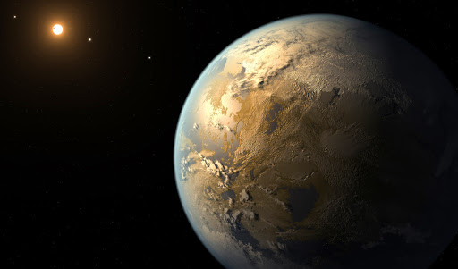

# Exoplanets

## Description

This project focuses on data wrangling as much as the exoplanet topic. 

## Code

The code is a [python](code/finalprojectdcs.ipynb) program created in Jupyter notebook.

## Data

The data was retrieved from api.nasa.gov and requires a login. The [folder](data/) containing the two CSV files is a part of this repository.

## Tools

* Python
* Jupyter Notebook