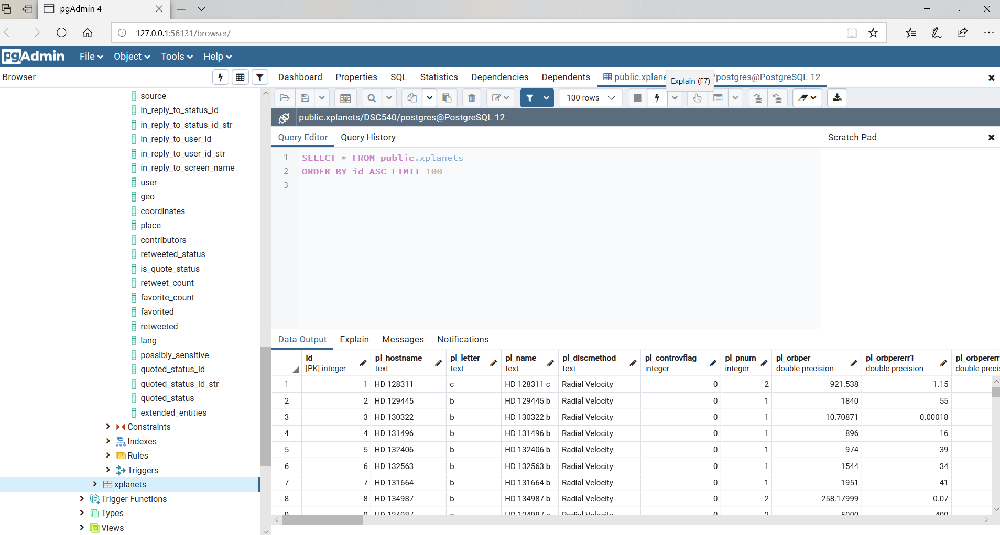
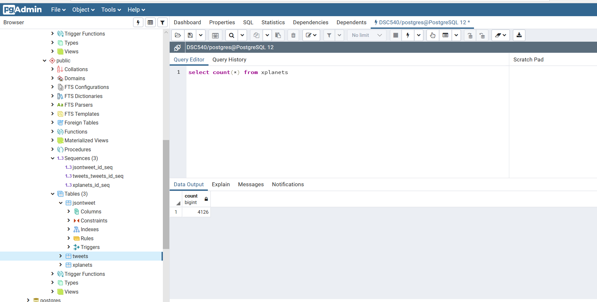

# Exoplanets

## Description

This project focuses on data wrangling as much as the exoplanet topic. The data was then loaded into a Postgres database.

## Code

The [code](code/finalprojectdcs.ipynb) is a python program created in Jupyter notebook. To view the pandas-profile, you will need to download and view in Jupyter notebook.

## Data

The data was retrieved from api.nasa.gov and requires a login. The [folder](data/) containing the two CSV files is a part of this repository.

## Documentation

The final [report](docs/Finalproject.pdf) analysis is included.

## Tools

* Python
* Jupyter Notebook