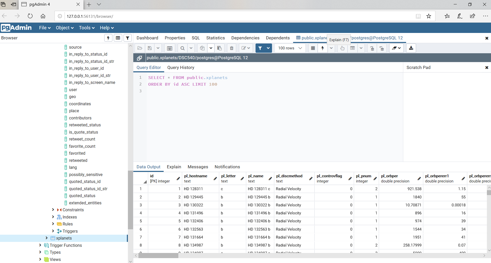
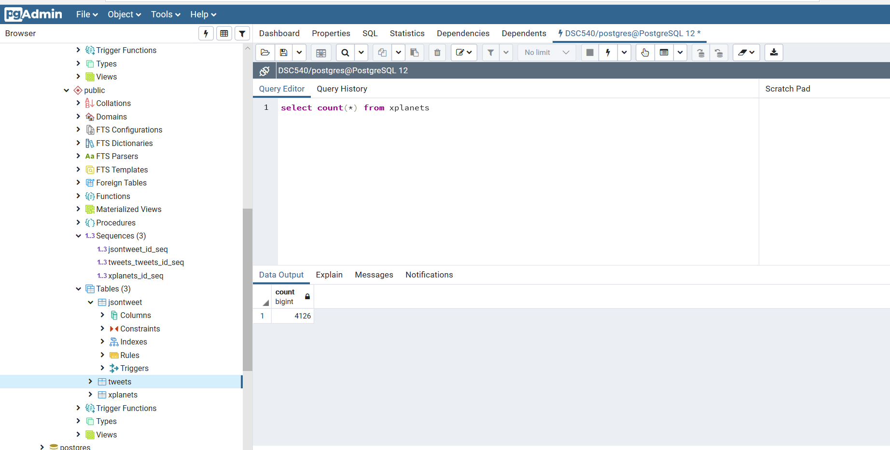

# Exoplanets

## Description

This project focuses on data wrangling as much as the exoplanet topic. The data was then loaded into a Postgres database.

## Postgres Screenshots

## Data

The data was retrieved from api.nasa.gov and requires a login. 

The [folder](https://github.com/SDLoyd/Exoplanets/tree/master/data) containing the three CSV files is a part of this repository.

_The exoplanet function wrapper used by the nasapy module is [deprecated](https://exoplanetarchive.ipac.caltech.edu/cgi-bin/nstedAPI/nph-nstedAPI?table=exoplanets) by a change at [Cal Tech](https://exoplanetarchive.ipac.caltech.edu)_ 

## EDA 

A minimal pandas-profiling [report](https://sdloyd.github.io/Exoplanets/pandasprofile/exoplanets-pandas-profile-report.html) is available.

## Code

The [code](https://github.com/SDLoyd/Exoplanets/blob/master/code/finalprojectdcs.ipynb) is a python program created in Jupyter notebook. To view the pandas-profile, you will need to download and view in Jupyter notebook or use the link on the next line.

If you have trouble with GitHub rendering the file, please try [here](https://nbviewer.jupyter.org/github/SDLoyd/Exoplanets/blob/master/code/finalprojectdcs.ipynb).

## Documentation

The final [report](docs/Finalproject.pdf) analysis is included.

## Instructions

To run this notebook locally, install Jupyter, download the data set, change the file location to load the code and data, and install all the library dependencies.

Try [Anaconda](https://www.anaconda.com/).

## Tools

* Python
* Jupyter Notebook
* Nasapy

## Credits

_Planet [image](https://www.nasa.gov/ames/kepler/kepler-186f-the-first-earth-size-planet-in-the-habitable-zone) by T. Pyle at [NASA Ames](https://www.nasa.gov/ames)_
